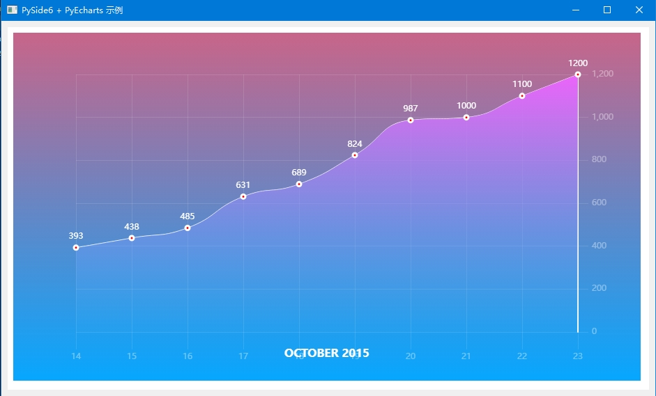
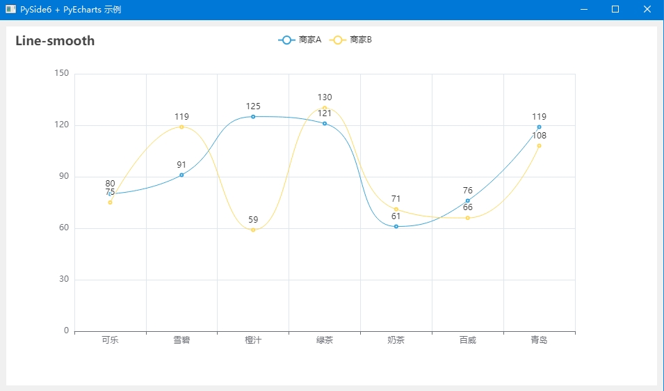
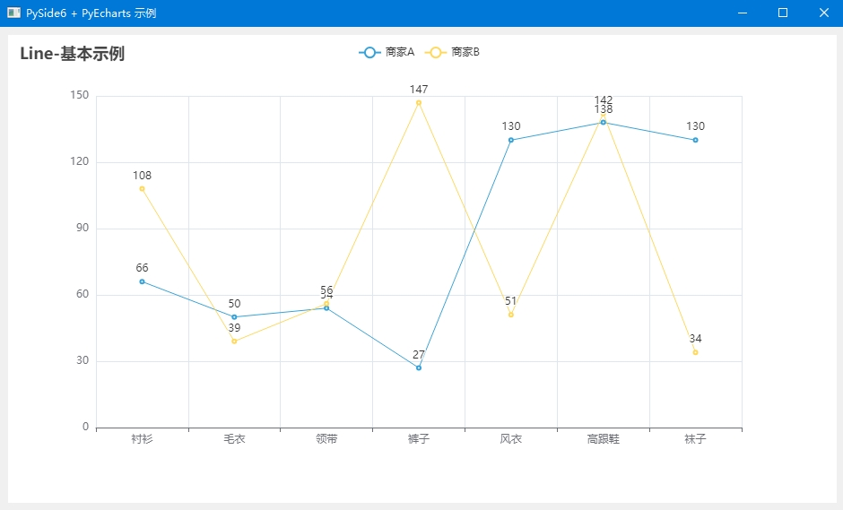

# PySide6_pyecharts_example

This is a simple example of using PySide6 and pyecharts to create a simple GUI application.

## 1. Requirements

Tested on Windows 10 with Python 3.11 .

Package requirements see requirements.txt .

## 2. Usage

```shell
python ./main.py
```

## 3. Screenshots





more examples see <https://gallery.pyecharts.org/#/README>
